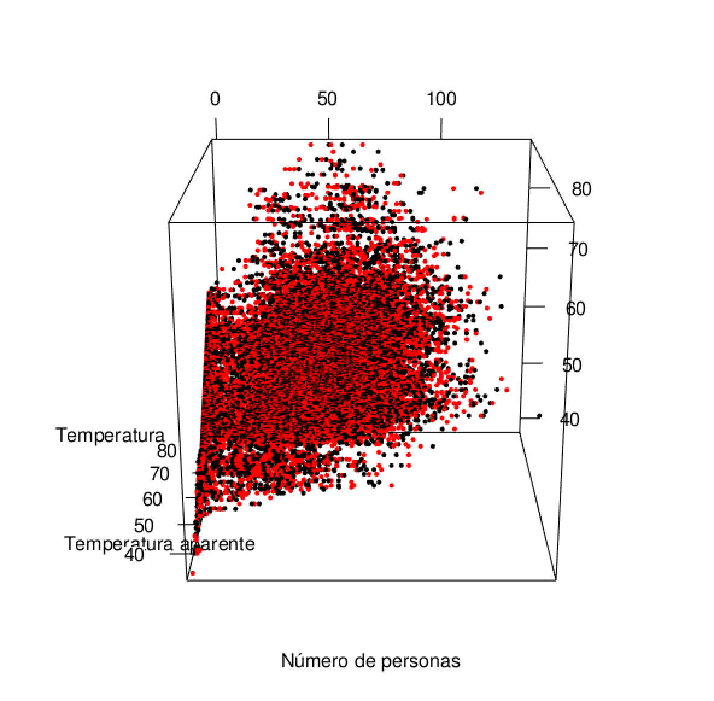

```{r setup, include=FALSE}
knitr::opts_chunk$set(echo = TRUE)
options(width=60)
knitr::opts_chunk$set(comment = "", warning = FALSE, message = FALSE, echo = TRUE, tidy = TRUE, size="small")
```
\newpage
#Personas en el gimnasio del campus

La base de datos que vamos a usar es _Crowdeness at campus gym_ que traducido al español es la población que hay dentro de un gimnasio universitario. 

Los atributos que tenemos son los siguientes:

* timestamp  (entero): el número de segundos desde el comienzo del día. 
* day_of_week (entero): día de la semana del 0 al 6.
* is_weekend (entero): si el día pertenece a un fin de semana. 
* is_holyday (entero): si el día es un día de vacaciones.
* apparent_temperature(real): temperatura aparente en el momento en el que se realiza la observación, en grados Farenheit.
* temperature (real): temperatura medida.
* is_start_of_semester (entero): indica si es el comienzo del semestre. 

Como salida se tiene el siguiente atributo:
* Number_of_people (entero)

El objetivo sobre esta base de datos es detectar si existen anomalías en el número de personas que están en el gimnasio.

```{r}
datos = read.csv("./data.csv", header = TRUE)
```

Base de datos obtenida de [Kaggle](https://www.kaggle.com/nsrose7224/crowdedness-at-the-campus-gym) 

\newpage
#Detección de anomalías

##Paquetes necesarios 

Son varios los paquetes de detección de anomalías que podemos encontrar disponibles para R, pero los que vamos a utilizar se listan a continuación. 

* Librerías de gráficos
```{r,message=FALSE}
library(ggplot2)
library(devtools)
library(reshape) 
library(ggbiplot)
library(rgl)  
library(GGally)
```

* Librerías de detección de anomalías para 1-variantes
```{r,message=FALSE}
library(outliers)
library(EnvStats)
```

* Librerías de detección de anomalías para multi-variantes
```{r,message=FALSE}
library(mvoutlier)       
library(CerioliOutlierDetection)
library(robustbase)
library(mvnormtest)   
library(MASS) 
```

* Librerías de detección de anomalías con métodos no supervisados
```{r,message=FALSE}
library(DMwR)
library(cluster)
```
\newpage
##Funciones básicas

Además de las funciones contenidas en los paquetes anteriormente mencionados necesitaresmos las siguientes funciones:

* MiPlot_Univariate_Outliers: muestra en un gráfico aquellos puntos que son anomalías. Para ello necesita los datos, un vector lógico que indique quienes son los outlier y el título del gráfico.
```{r}
MiPlot_Univariate_Outliers = function (datos, indices_de_Outliers, titulo){
  numero.de.datos = nrow(as.matrix(datos))
  vectorTFoutliers =  rep(FALSE, numero.de.datos)
  vectorTFoutliers[indices_de_Outliers] = TRUE
  vector.colores.outlier = rep("black", numero.de.datos)
  vector.colores.outlier [vectorTFoutliers] = "red"
  
  #cat("\nN?mero de datos: ")
  #cat(numero.de.datos)
  #cat("\n?Qui?n es outlier?: ")
  #cat(vectorTFoutliers)
  #cat('\n')
  
  x11()
  plot(datos, col=vector.colores.outlier, main = titulo)
}
```

* vector_es_outlier_IQR: devuelve un vector que determina si el valor en la posición i-ésima es una anomalía o no basándose en la distancia intercuartil.
```{r}
vector_es_outlier_IQR = function (datos, indice.de.columna, coef = 1.5){
  columna.datos = datos[,indice.de.columna]
  cuartil.primero = quantile(columna.datos)[2]  #quantile[1] es el m?nimo y quantile[5] el m?ximo.
  cuartil.tercero = quantile(columna.datos)[4] 
  iqr = cuartil.tercero - cuartil.primero
  extremo.superior.outlier = (iqr * coef) + cuartil.tercero
  extremo.inferior.outlier = cuartil.primero - (iqr * coef)
  es.outlier  = columna.datos > extremo.superior.outlier |
    columna.datos < extremo.inferior.outlier
  return (es.outlier)
}
```

* Nombres_de_Filas: devuelve el nombre de las filas
```{r}
Nombres_de_Filas = function (datos, vector_TF_datos_a_incluir) {
  numero.de.filas = nrow(datos)
  
  if (is.null(row.names(datos)))
    row.names(datos) = rep(1:numero.de.filas)
  
  nombres.de.filas = rep("", numero.de.filas)
  nombres.de.filas[vector_TF_datos_a_incluir==TRUE] = row.names(datos)[vector_TF_datos_a_incluir==TRUE]
  nombres.de.filas
}
```

\newpage

* vector_claves_outliers_IQR: devuelve un vector con los índices de los outliers. 
```{r}
vector_claves_outliers_IQR = function(datos, indice, coef = 1.5){
  columna.datos = datos[,indice]
  vector.de.outliers = vector_es_outlier_IQR(datos, indice, coef)
  which(vector.de.outliers  == TRUE)
}
```


* MiBoxPlot_IQR_Univariate_Outliers: genera un gráfico de cajas de todas aquellas variables que se le indiquen en _indice.de.columna_ . Si se le especifica el valor 3 de coeficiente se determinan aquellas anomalías consideradas extremas. 

```{r}
MiBoxPlot_IQR_Univariate_Outliers = function (datos, indice.de.columna, coef = 1.5){
  
  datos = as.data.frame(datos)
  vector.TF.outliers.IQR = vector_es_outlier_IQR(datos, indice.de.columna, coef)
  nombres.de.filas = Nombres_de_Filas(datos, vector.TF.outliers.IQR)
  nombre.de.columna = colnames(datos, indice.de.columna)
  
  ggboxplot = ggplot(data = datos, aes(x=factor(""), y=datos[,indice.de.columna]) , environment = environment()) + 
    xlab(nombre.de.columna) + ylab("") +
    geom_boxplot(outlier.colour = "red") + 
    geom_text(aes(label = nombres.de.filas)) #, position = position_jitter(width = 0.1))   
  
  x11()
  ggboxplot
}
```

* MiBoxPlot_juntos: muestran en un mismo gráfico todos los boxplot
```{r}
MiBoxPlot_juntos  = function (datos, vector_TF_datos_a_incluir = c()){  
 
  nombres.de.filas = Nombres_de_Filas(datos, vector_TF_datos_a_incluir)
  
  datos = scale(datos)
  datos.melted = melt(datos)
  colnames(datos.melted)[2]="Variables"
  colnames(datos.melted)[3]="zscore"
  factor.melted = colnames(datos.melted)[1]
  columna.factor = as.factor(datos.melted[,factor.melted])
  levels(columna.factor)[!levels(columna.factor) %in% nombres.de.filas] = ""  
  
  ggplot(data = datos.melted, aes(x=Variables, y=zscore), environment = environment()) + 
    geom_boxplot(outlier.colour = "red") + 
    geom_text(aes(label = columna.factor), size = 3) 
}

```

\newpage

* MiBoxPlot_juntos_con_etiquetas: muestra en un solo gráfico todas los boxplot con sus etiquetas. 
```{r}
MiBoxPlot_juntos_con_etiquetas = function (datos, coef = 1.5){
  matriz.datos.TF.outliers = sapply(1:ncol(datos), function(x) vector_es_outlier_IQR(datos, x, coef))  # Aplicamos outlier IQR a cada columna
  vector.datos.TF.outliers = apply(matriz.datos.TF.outliers, 1, sum)   
  vector.datos.TF.outliers[vector.datos.TF.outliers > 1] = 1            # Si un registro es outlier en alguna columna lo incluimos
  
  MiBoxPlot_juntos(datos, vector.datos.TF.outliers)
}
```

* MiPlot_resultados_TestGrubbs: aplica el test de Grubbs.
```{r}
MiPlot_resultados_TestGrubbs = function(datos){
  alpha = 0.05
  
  test.de.Grubbs = grubbs.test(datos, two.sided = TRUE)
  cat('p.value: ')
  cat(test.de.Grubbs$p.value)
  cat('\n')
  
  if (test.de.Grubbs$p.value < alpha){
    indice.de.outlier.Grubbs = order(abs(datos - mean(datos)), decreasing = T)[1]
    indice.de.outlier.Grubbs
    cat('?ndice de outlier: ')
    cat(indice.de.outlier.Grubbs)
    cat('\n')
    valor.de.outlier.Grubbs  = datos[indice.de.outlier.Grubbs]
    cat('Valor del outlier: ')
    cat(valor.de.outlier.Grubbs)
    MiPlot_Univariate_Outliers (datos, "Test de Grubbs", indice.de.outlier.Grubbs)
  }
  else
    cat('No hay outliers')
}
```

* MiPlot_resultados_TestRosner: realiza el test de Rosner sobre la base de datos.
```{r}
MiPlot_resultados_TestRosner = function(datos){  
  test.de.rosner = rosnerTest(datos, k=4)
  is.outlier.rosner = test.de.rosner$all.stats$Outlier
  k.mayores.desviaciones.de.la.media = test.de.rosner$all.stats$Obs.Num
  indices.de.outliers.rosner = k.mayores.desviaciones.de.la.media[is.outlier.rosner]
  valores.de.outliers.rosner = datos[indices.de.outliers.rosner]
  cat("\nTest de Rosner")
  cat("\n?ndices de las k-mayores desviaciones de la media: ")
  cat(k.mayores.desviaciones.de.la.media)
  cat("\nDe las k mayores desviaciones, ?Qui?n es outlier? ")
  cat(is.outlier.rosner)
  cat("\nLos ?ndices de los outliers son: ")
  cat(indices.de.outliers.rosner)
  cat("\nLos valores de los outliers son: ")
  cat(valores.de.outliers.rosner)
  MiPlot_Univariate_Outliers (datos, indices.de.outliers.rosner, "Test de Rosner")
}
```

* MiBiplot y MiBiPlot_Multivariate_Outliers : reduce las dimensiones de la base de datos y muestra el gráfico biplot.
```{r}
MiBiplot = function(datos){
  PCA.model = princomp(scale(datos))
  biplot = ggbiplot(PCA.model, obs.scale = 1, var.scale=1 , varname.size = 5) 
  x11()
  print(biplot)
}

MiBiPlot_Multivariate_Outliers = function (datos, vectorTFoutliers, titulo){
   identificadores_de_datos = rownames(datos)
   identificadores_de_datos[!vectorTFoutliers] = ''
   cat(identificadores_de_datos)
 
   PCA.model = princomp(scale(datos))
   outlier.shapes = c(".","x") #c(21,8)
   biplot = ggbiplot(PCA.model, obs.scale = 1, var.scale=1 , varname.size = 5,groups =  vectorTFoutliers) #alpha = 1/10, 
   biplot = biplot + labs(color = "Outliers")
   biplot = biplot + scale_color_manual(values = c("black","red"))
   biplot = biplot + geom_text(label = identificadores_de_datos, stat = "identity", size = 3, hjust=0, vjust=0)
   biplot = biplot + ggtitle(titulo)
  
   x11()
   print(biplot)
}
```

* MiBiPlot_Clustering_Outliers: realiza una clusterización y después genera un gráfico biplot.  
```{r}
MiBiPlot_Clustering_Outliers = function (datos, titulo){
  PCA.model = princomp(scale(datos))
  outlier.shapes = c("o","x") #c(21,8)
  
  identificadores_de_datos = rownames(datos)
  identificadores_de_datos[!BIPLOT.isOutlier] = ''
  #cat(identificadores_de_datos)
  
  BIPLOT.asignaciones.clusters = factor(BIPLOT.asignaciones.clusters)
  
  biplot = ggbiplot(PCA.model, obs.scale = 1, var.scale=1 , varname.size = 3, alpha = 0) +              
    geom_point(aes(shape = BIPLOT.isOutlier, colour = factor(BIPLOT.asignaciones.clusters)))  +
    scale_color_manual(values = BIPLOT.cluster.colors) +
    scale_shape_manual(values = outlier.shapes) +
    ggtitle(titulo) +
    geom_text(label = identificadores_de_datos, stat = "identity", size = 3, hjust=0, vjust=0)      
  
  x11()
  print(biplot)
}
```

\newpage

##Detección de anomalías univariante por método gráfico

Como primera aproximación a la detección de anomalías, vamos a estudiar cada una de las variables para saber si contienen valores anómalos. Para ello utilizaremos el test de la distancia intercuartil (IQR).

La distancia intercuartil la calculamos como la resta del primer cuartil al primero.

```{r}
vectorIQR = apply(datos,2,function(x){iqr = quantile(x,0.75) - quantile(x,0.25)})
vectorQuantiles = apply(datos,2,function(x){quantile(x,.25)})
vectorQuantiles = rbind(vectorQuantiles,apply(datos,2,function(x){quantile(x,.75)}))
vectorIQR = rbind(vectorIQR,vectorQuantiles)
```

En este momento en el vectorIQR tenemos en la primera línea la distancia intercuartil y en las dos siguientes filas el primer y el tercer cuartil. Con esta información podemos determinar  si son outliers y si son extremos outliers. 

```{r}
outlierMatrix = matrix(data=FALSE,nrow=(dim(datos)[1]),ncol = (dim(datos)[2]))
for(i in 1:(dim(datos)[1])){
  for(j in 1:(dim(datos)[2])){
    outlierMatrix[i,j] = datos[i,j] > vectorIQR[1,j]*1.5 + vectorIQR[3,j] | datos[i,j] <   vectorIQR[2,j] - vectorIQR[1,j]*1.5
  }
}
```
En este momento tenemos en _outlierMatrix_ todos aquellas posiciones que son outliers normales, es decir que están a más de 1,5*distancia intercuartil de los cuartiles primero y tercero. 

Pero lo cierto es que este método no es aplicable a todas las variables, un ejemplo de ello es la variable _timestamp_, _dayOfWeek_, _isWeekend_, _isHoliday_ o _isStartOfSemester_ que solo tiene valor descriptivo. Por ello tenemos que eliminar todos aquellos datos que nos sobran y que hemos calculado por limpieza de código. 

```{r}
outlierMatrix[,c(2,3,4,5,8)] = NA
```

Los outlier calculados se muestran a continuación:

```{r,message=FALSE,warning=FALSE,comment=FALSE,error=FALSE}
MiPlot_Univariate_Outliers(datos[,1],which(outlierMatrix[,1]==TRUE),"Number of people")
MiPlot_Univariate_Outliers(datos[,6],which(outlierMatrix[,6]==TRUE),"Apparent Temperature")
MiPlot_Univariate_Outliers(datos[,7],which(outlierMatrix[,7]==TRUE),"Temperature")
```


En las gráficas de las variables _apparent temperature_ y _temperature_ podemos ver como se determinan como outliers valores que están perfetamente cohesionados con los valores de alrededor. Por este motivo la detección de outlier mediante el método de IQR no lo considero ideal. 
Sin embargo en la primera gráfica, correpondiente a la variable _number of people_ , si me interesan unos valores que no están del todo cohesionados. Lo mantenemos en mente, porque nos puede servir para un test de Grubb o para uno de Rosner.

##Detección de anomalías en variables univariantes mediante métodos estadísticos

Como ya vimos en el apartado anterior es posible que en la variable _number of people_ haya outliers. Para confirmarlo vamos a realizar dos test estadísticos: el test de Grubb que detecta si hay un outlier y el test de Rosner que detecta si hay exactamente k outliers.

###Test de Grubb

El test de Grubb se realiza con la llama _grubbs.test_ del paquete _outliers_ que cargamos anteriormente. Si el test sale afirmativo veremos en pantalla el valor del índice en el que se encuentra y el valor que toma. Tras ello lo mostraremos para ver si se corresponde gráficamente con un outlier.

```{r}
testGrubb = grubbs.test(datos[,1], two.sided = TRUE)

if(testGrubb$p.value < 0.025){
  index = order(abs(datos[,1] - mean(datos[,1])), decreasing = T)[1]
  value = datos[index,1]
}
index
value

MiPlot_Univariate_Outliers(datos[,1],index,"Outlier")
```


El valor señalado con el test de Grubb se corresponde con un valor que graficamente determinaríamos como outlier. 


###Test de Rosner

Del gráfico podríamos pensar que no solo ese valor podría ser un outlier, sino también otros situados por encima de la montaña de puntos situada a la derecha. Para determinar si eso es así utilizamos el test de Rosner.

```{r}
testRosner = rosnerTest(datos[,1],k=10)
isRosnerOutlier = testRosner$all.stats$Outlier
kMayoresDesviacionesMedia = testRosner$all.stats$Obs.Num
indexesOutliers = kMayoresDesviacionesMedia[isRosnerOutlier]
indexesOutliers
```

Según Rosner no hay ningún outlier. 

\newpage
##Detección de anomalías multivariante

Puede que no haya ningún outlier de forma univariante pero puede ser que si miramos los datos con más de una variable si nos encontremos con outliers. Para detectar este tipo de anomalías nos basaremos en las funciones del paquete _mvoutlier_ . Este paquete por defecto usa la distancia Mahalanobis para detectar si el dato es outlier o no. 

Lo primero que tenemos que hacer es determinar el grado de confianza al que queremos trabajar. 
```{r}
alpha = 0.05
alphaPenalizado = 1- (1 - alpha) ^ (1/nrow(datos))
```

Tras ello obtendremos un gráfico del tipo _uni.plot_ que nos devolverá los índices de aquellos datos que son outliers.

```{r}
moutlier = uni.plot(datos[,c(1,6,7)],symb=FALSE,alpha = alphaPenalizado)
```

Con este gráfico podemos comprobar que sí que existen outliers al combinar las tress variables de dominio real. Si queremos realizar un estudio de qué variables son las que más influyen en la designación de los outliers utilizaremos un plot en tres dimensiones, dado que se puede representar perfectamente en tres dimensiones no es necesario realizar una reducción de dimensiones mediante el algoritmo PCA.

```{r}
cat("Valores outliers")
sum(moutlier$outliers == TRUE)
cat("Valores normales")
sum(moutlier$outliers == FALSE)
plotData = cbind(datos,moutlier$outliers)
plot3d(x=plotData[,1],y=plotData[,6], z=plotData[,7], colvar =moutlier$outliers, col= c("black","red"), xlab = "Número de personas", ylab="Temperatura aparente", zlab="Temperatura") 
legend3d("topright", c("Valores normales", "Anomalías"), col= c("black","red"), pch=16)
```

A continuación se muestran tres perspectivas de la nube de puntos resultantes de la llamada a  _plot3d_.




Mirando el gráfico parece que el número de anomalías es igual al de los datos normales, pero si volvemos a la cuenta de cada tipo de datos vemos que efectivamente los outliers están en minoría, lo que significa que varios registros tienen el mismo valor para las tres componentes y se superponen en el gráfico. 

##Detección de anomalías basandose en clustering

